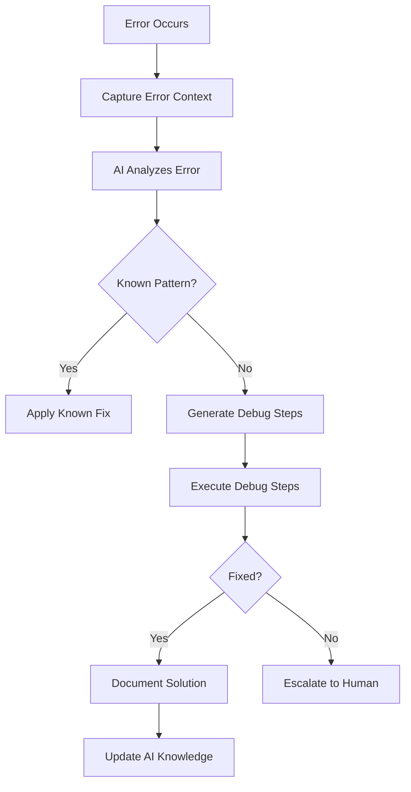

# 🤖 AI-POWERED DEVELOPMENT GUIDE FOR RGB LIGHT CAT
## **The Ultimate Guide to Building with AI Assistance**

---

# 🚀 **QUICK START WITH AI**

## **1. AI Development Commands**

```bash
# Start AI-assisted development
npm run ai:assist

# Generate component from description
npm run ai:component "Create a responsive stats card with animated numbers"

# Generate API endpoint
npm run ai:api "Create endpoint for fetching user transaction history"

# Fix bugs with AI
npm run ai:fix "TypeError: Cannot read property 'x' of undefined at line 42"

# Optimize performance
npm run ai:optimize src/components/GameCanvas.tsx

# Generate tests
npm run ai:test src/services/PaymentService.ts

# Document code
npm run ai:document src/core/auth/AuthManager.ts
```

## **2. AI Prompt Templates**

### **Component Creation**
```
Create a [TYPE] component that:
- Has [FEATURES]
- Follows our design system
- Is mobile responsive
- Includes TypeScript types
- Has loading and error states
- Includes unit tests
- Uses our existing [DEPENDENCIES]

Example: "Create a modal component that displays payment confirmation with QR code, 
follows our primary color scheme, is mobile responsive, includes TypeScript types,
has loading spinner while generating QR, shows error if payment fails, includes
Jest tests, and uses our existing EventBus for communication"
```

### **Bug Fixing**
```
Fix this error:
ERROR: [ERROR MESSAGE]
File: [FILE PATH]
Line: [LINE NUMBER]
Context: [WHAT USER WAS DOING]

The fix should:
- Resolve the error
- Prevent similar errors
- Include error handling
- Add relevant tests
- Not break existing functionality
```

### **Performance Optimization**
```
Optimize [COMPONENT/FUNCTION] for:
- [METRIC] (e.g., load time, FPS, memory usage)
- Current performance: [CURRENT]
- Target performance: [TARGET]

Constraints:
- Maintain existing functionality
- Keep code readable
- Follow our patterns
- Add performance tests
```

---

# 📚 **AI-ASSISTED DEVELOPMENT PATTERNS**

## **1. Component Generation Pattern**

### **Input to AI:**
```typescript
// Generate a TierCard component
interface TierCardRequirements {
  tier: 'bronze' | 'silver' | 'gold';
  features: string[];
  price: number;
  maxBatches: number;
  unlocked: boolean;
  onSelect: () => void;
}
```

### **AI Output:**
```typescript
/**
 * @fileoverview Tier Card Component
 * @description Displays game tier information with unlock status
 * Generated by AI Assistant
 */

import React, { useState, useCallback } from 'react';
import { motion, AnimatePresence } from 'framer-motion';
import { useTheme } from '../hooks/useTheme';
import { formatNumber } from '../utils/formatters';
import { Badge } from './atoms/Badge';
import { Button } from './atoms/Button';
import { Icon } from './atoms/Icon';

interface TierCardProps {
  tier: 'bronze' | 'silver' | 'gold';
  features: string[];
  price: number;
  maxBatches: number;
  unlocked: boolean;
  selected?: boolean;
  onSelect: () => void;
}

const tierColors = {
  bronze: {
    bg: 'bg-orange-50',
    border: 'border-orange-300',
    text: 'text-orange-800',
    accent: '#CD7F32'
  },
  silver: {
    bg: 'bg-gray-50',
    border: 'border-gray-300',
    text: 'text-gray-800',
    accent: '#C0C0C0'
  },
  gold: {
    bg: 'bg-yellow-50',
    border: 'border-yellow-300',
    text: 'text-yellow-800',
    accent: '#FFD700'
  }
};

export const TierCard: React.FC<TierCardProps> = ({
  tier,
  features,
  price,
  maxBatches,
  unlocked,
  selected = false,
  onSelect
}) => {
  const [isHovered, setIsHovered] = useState(false);
  const theme = useTheme();
  const colors = tierColors[tier];

  const handleSelect = useCallback(() => {
    if (unlocked) {
      onSelect();
    }
  }, [unlocked, onSelect]);

  return (
    <motion.div
      initial={{ opacity: 0, y: 20 }}
      animate={{ opacity: 1, y: 0 }}
      whileHover={{ scale: unlocked ? 1.02 : 1 }}
      onHoverStart={() => setIsHovered(true)}
      onHoverEnd={() => setIsHovered(false)}
      className={`
        relative overflow-hidden rounded-xl p-6
        ${colors.bg} ${colors.border} border-2
        ${unlocked ? 'cursor-pointer' : 'opacity-60 cursor-not-allowed'}
        ${selected ? 'ring-4 ring-primary-400' : ''}
        transition-all duration-300
      `}
      onClick={handleSelect}
      role="button"
      aria-label={`Select ${tier} tier`}
      aria-disabled={!unlocked}
    >
      {/* Locked Overlay */}
      <AnimatePresence>
        {!unlocked && (
          <motion.div
            initial={{ opacity: 0 }}
            animate={{ opacity: 1 }}
            exit={{ opacity: 0 }}
            className="absolute inset-0 bg-black bg-opacity-50 flex items-center justify-center z-10"
          >
            <div className="text-white text-center">
              <Icon name="lock" size={48} />
              <p className="mt-2 font-semibold">Unlock in Game</p>
            </div>
          </motion.div>
        )}
      </AnimatePresence>

      {/* Tier Header */}
      <div className="flex items-start justify-between mb-4">
        <div>
          <h3 className={`text-2xl font-bold capitalize ${colors.text}`}>
            {tier}
          </h3>
          <Badge variant={unlocked ? 'success' : 'default'}>
            {unlocked ? 'Unlocked' : 'Locked'}
          </Badge>
        </div>
        <div 
          className="w-16 h-16 rounded-full flex items-center justify-center"
          style={{ backgroundColor: colors.accent }}
        >
          <Icon 
            name={tier === 'bronze' ? 'bronze-medal' : tier === 'silver' ? 'silver-medal' : 'gold-medal'} 
            size={32} 
            color="white"
          />
        </div>
      </div>

      {/* Price */}
      <div className="mb-4">
        <p className="text-sm text-gray-600">Price per batch</p>
        <p className={`text-3xl font-bold ${colors.text}`}>
          {formatNumber(price)} sats
        </p>
      </div>

      {/* Features */}
      <div className="mb-6">
        <p className="text-sm font-semibold text-gray-700 mb-2">Features:</p>
        <ul className="space-y-2">
          {features.map((feature, index) => (
            <motion.li
              key={index}
              initial={{ opacity: 0, x: -20 }}
              animate={{ opacity: 1, x: 0 }}
              transition={{ delay: index * 0.1 }}
              className="flex items-center text-sm text-gray-600"
            >
              <Icon name="check-circle" size={16} className="mr-2 text-green-500" />
              {feature}
            </motion.li>
          ))}
        </ul>
      </div>

      {/* Max Batches */}
      <div className="mb-6">
        <p className="text-sm text-gray-600">Maximum purchase</p>
        <p className={`text-xl font-semibold ${colors.text}`}>
          {maxBatches} batches ({formatNumber(maxBatches * 700)} LIGHT)
        </p>
      </div>

      {/* Select Button */}
      <Button
        variant={selected ? 'primary' : 'secondary'}
        fullWidth
        disabled={!unlocked}
        onClick={handleSelect}
        className={`
          ${selected ? 'bg-primary-600 hover:bg-primary-700' : ''}
          ${!unlocked ? 'opacity-50 cursor-not-allowed' : ''}
        `}
      >
        {selected ? 'Selected' : 'Select Tier'}
      </Button>

      {/* Hover Effect */}
      <AnimatePresence>
        {isHovered && unlocked && (
          <motion.div
            initial={{ opacity: 0 }}
            animate={{ opacity: 1 }}
            exit={{ opacity: 0 }}
            className="absolute inset-0 pointer-events-none"
            style={{
              background: `radial-gradient(circle at center, ${colors.accent}20 0%, transparent 70%)`
            }}
          />
        )}
      </AnimatePresence>
    </motion.div>
  );
};

// Unit Tests
describe('TierCard', () => {
  const defaultProps = {
    tier: 'silver' as const,
    features: ['Feature 1', 'Feature 2'],
    price: 2000,
    maxBatches: 20,
    unlocked: true,
    onSelect: jest.fn()
  };

  it('renders correctly', () => {
    const { getByText } = render(<TierCard {...defaultProps} />);
    expect(getByText('silver')).toBeInTheDocument();
    expect(getByText('2,000 sats')).toBeInTheDocument();
  });

  it('shows locked state', () => {
    const { getByText } = render(<TierCard {...defaultProps} unlocked={false} />);
    expect(getByText('Unlock in Game')).toBeInTheDocument();
  });

  it('calls onSelect when clicked if unlocked', () => {
    const onSelect = jest.fn();
    const { container } = render(<TierCard {...defaultProps} onSelect={onSelect} />);
    fireEvent.click(container.firstChild);
    expect(onSelect).toHaveBeenCalled();
  });

  it('does not call onSelect when locked', () => {
    const onSelect = jest.fn();
    const { container } = render(<TierCard {...defaultProps} unlocked={false} onSelect={onSelect} />);
    fireEvent.click(container.firstChild);
    expect(onSelect).not.toHaveBeenCalled();
  });
});
```

## **2. API Endpoint Generation Pattern**

### **Input to AI:**
```
Create an API endpoint for transaction history that:
- Returns paginated results
- Filters by date range
- Includes transaction details
- Has proper error handling
- Uses our authentication
- Includes rate limiting
```

### **AI Output:**
```typescript
/**
 * @fileoverview Transaction History API Endpoint
 * @description Retrieves user transaction history with pagination and filtering
 * Generated by AI Assistant
 */

import { Request, Response, NextFunction } from 'express';
import { body, query, validationResult } from 'express-validator';
import { AuthenticatedRequest } from '../types/express';
import { TransactionService } from '../services/TransactionService';
import { Logger } from '../utils/Logger';
import { ApiError } from '../errors/ApiError';
import { cache } from '../middleware/cache';
import { rateLimiter } from '../middleware/rateLimiter';
import { authenticate } from '../middleware/authenticate';

const logger = new Logger('TransactionHistoryAPI');

// Validation rules
const validateTransactionQuery = [
  query('page').optional().isInt({ min: 1 }).withMessage('Page must be a positive integer'),
  query('limit').optional().isInt({ min: 1, max: 100 }).withMessage('Limit must be between 1 and 100'),
  query('startDate').optional().isISO8601().withMessage('Start date must be valid ISO 8601 date'),
  query('endDate').optional().isISO8601().withMessage('End date must be valid ISO 8601 date'),
  query('status').optional().isIn(['pending', 'completed', 'failed']).withMessage('Invalid status'),
  query('type').optional().isIn(['purchase', 'withdrawal', 'transfer']).withMessage('Invalid type')
];

/**
 * GET /api/transactions
 * Retrieves paginated transaction history for authenticated user
 */
export const getTransactionHistory = [
  authenticate,
  rateLimiter({ windowMs: 60000, max: 30 }), // 30 requests per minute
  cache({ ttl: 60 }), // Cache for 60 seconds
  ...validateTransactionQuery,
  async (req: AuthenticatedRequest, res: Response, next: NextFunction) => {
    try {
      // Validate request
      const errors = validationResult(req);
      if (!errors.isEmpty()) {
        throw new ApiError(400, 'Validation error', errors.array());
      }

      const userId = req.user!.id;
      const {
        page = 1,
        limit = 20,
        startDate,
        endDate,
        status,
        type
      } = req.query;

      // Build filter criteria
      const filters = {
        userId,
        ...(startDate && { startDate: new Date(startDate as string) }),
        ...(endDate && { endDate: new Date(endDate as string) }),
        ...(status && { status: status as string }),
        ...(type && { type: type as string })
      };

      // Validate date range
      if (filters.startDate && filters.endDate && filters.startDate > filters.endDate) {
        throw new ApiError(400, 'Start date must be before end date');
      }

      // Fetch transactions
      const result = await TransactionService.getTransactionHistory({
        filters,
        pagination: {
          page: Number(page),
          limit: Number(limit)
        }
      });

      // Format response
      const response = {
        success: true,
        data: {
          transactions: result.transactions.map(formatTransaction),
          pagination: {
            page: result.page,
            limit: result.limit,
            total: result.total,
            totalPages: Math.ceil(result.total / result.limit),
            hasNext: result.page < Math.ceil(result.total / result.limit),
            hasPrev: result.page > 1
          },
          summary: {
            totalAmount: result.summary.totalAmount,
            transactionCount: result.summary.count,
            dateRange: {
              start: filters.startDate || result.summary.earliestDate,
              end: filters.endDate || result.summary.latestDate
            }
          }
        }
      };

      // Log successful request
      logger.info('Transaction history retrieved', {
        userId,
        page: result.page,
        count: result.transactions.length
      });

      res.json(response);

    } catch (error) {
      next(error);
    }
  }
];

/**
 * GET /api/transactions/:id
 * Retrieves single transaction details
 */
export const getTransactionById = [
  authenticate,
  rateLimiter({ windowMs: 60000, max: 60 }), // 60 requests per minute
  async (req: AuthenticatedRequest, res: Response, next: NextFunction) => {
    try {
      const userId = req.user!.id;
      const transactionId = req.params.id;

      // Validate transaction ID format
      if (!isValidUUID(transactionId)) {
        throw new ApiError(400, 'Invalid transaction ID format');
      }

      // Fetch transaction
      const transaction = await TransactionService.getTransactionById(transactionId);

      // Check ownership
      if (!transaction || transaction.userId !== userId) {
        throw new ApiError(404, 'Transaction not found');
      }

      // Format response
      const response = {
        success: true,
        data: formatTransactionDetail(transaction)
      };

      res.json(response);

    } catch (error) {
      next(error);
    }
  }
];

/**
 * POST /api/transactions/export
 * Exports transaction history as CSV/PDF
 */
export const exportTransactions = [
  authenticate,
  rateLimiter({ windowMs: 300000, max: 5 }), // 5 exports per 5 minutes
  body('format').isIn(['csv', 'pdf']).withMessage('Format must be csv or pdf'),
  body('startDate').optional().isISO8601(),
  body('endDate').optional().isISO8601(),
  async (req: AuthenticatedRequest, res: Response, next: NextFunction) => {
    try {
      const errors = validationResult(req);
      if (!errors.isEmpty()) {
        throw new ApiError(400, 'Validation error', errors.array());
      }

      const userId = req.user!.id;
      const { format, startDate, endDate } = req.body;

      // Generate export
      const exportData = await TransactionService.exportTransactions({
        userId,
        format,
        dateRange: {
          start: startDate ? new Date(startDate) : undefined,
          end: endDate ? new Date(endDate) : undefined
        }
      });

      // Set headers
      const filename = `transactions_${Date.now()}.${format}`;
      res.setHeader('Content-Type', format === 'csv' ? 'text/csv' : 'application/pdf');
      res.setHeader('Content-Disposition', `attachment; filename="${filename}"`);

      // Send file
      res.send(exportData);

      logger.info('Transactions exported', { userId, format });

    } catch (error) {
      next(error);
    }
  }
];

// Helper functions
function formatTransaction(transaction: any) {
  return {
    id: transaction.id,
    type: transaction.type,
    status: transaction.status,
    amount: transaction.amount,
    currency: transaction.currency,
    description: transaction.description,
    createdAt: transaction.createdAt,
    completedAt: transaction.completedAt,
    metadata: {
      batchCount: transaction.metadata?.batchCount,
      tier: transaction.metadata?.tier,
      invoiceId: transaction.metadata?.invoiceId
    }
  };
}

function formatTransactionDetail(transaction: any) {
  return {
    ...formatTransaction(transaction),
    details: {
      rgbInvoice: transaction.rgbInvoice,
      lightningInvoice: transaction.lightningInvoice,
      consignmentFile: transaction.consignmentFile,
      blockHeight: transaction.blockHeight,
      txid: transaction.txid
    },
    timeline: transaction.timeline || [],
    fees: {
      network: transaction.networkFee,
      service: transaction.serviceFee,
      total: transaction.totalFee
    }
  };
}

function isValidUUID(uuid: string): boolean {
  const uuidRegex = /^[0-9a-f]{8}-[0-9a-f]{4}-4[0-9a-f]{3}-[89ab][0-9a-f]{3}-[0-9a-f]{12}$/i;
  return uuidRegex.test(uuid);
}

// Export routes
export const transactionRoutes = {
  'GET /api/transactions': getTransactionHistory,
  'GET /api/transactions/:id': getTransactionById,
  'POST /api/transactions/export': exportTransactions
};
```

## **3. Bug Fix Pattern**

### **Input to AI:**
```
Fix: TypeError: Cannot read property 'score' of undefined
File: GameEngine.js, Line: 156
Context: Happens when game ends and score is being saved
Current code:
```javascript
endGame() {
  this.isRunning = false;
  const finalScore = this.player.score;
  this.saveScore(finalScore);
}
```

### **AI Output:**
```javascript
/**
 * Fixed: Safely handle game end with proper null checks and error handling
 * Issue: player object could be undefined if game ends abnormally
 */

endGame() {
  try {
    // Ensure game is actually running before ending
    if (!this.isRunning) {
      console.warn('endGame called but game is not running');
      return;
    }

    this.isRunning = false;

    // Safely access player score with multiple fallbacks
    const finalScore = this.player?.score ?? this.currentScore ?? 0;

    // Validate score before saving
    if (typeof finalScore !== 'number' || finalScore < 0) {
      console.error('Invalid score detected:', finalScore);
      this.handleGameError(new Error('Invalid score at game end'));
      return;
    }

    // Save score with error handling
    this.saveScore(finalScore)
      .catch(error => {
        console.error('Failed to save score:', error);
        // Store locally for retry
        this.queueScoreForRetry(finalScore);
      });

    // Clean up game resources
    this.cleanup();

    // Emit game end event
    this.emit('gameEnded', { 
      score: finalScore, 
      duration: Date.now() - this.startTime,
      reason: 'normal'
    });

  } catch (error) {
    console.error('Error in endGame:', error);
    this.handleGameError(error);
  }
}

// Additional safety methods
handleGameError(error) {
  this.isRunning = false;
  this.emit('gameError', { error, phase: 'ending' });
  
  // Attempt to save partial data
  const emergencyScore = this.getEmergencyScore();
  if (emergencyScore > 0) {
    this.queueScoreForRetry(emergencyScore);
  }
}

getEmergencyScore() {
  // Multiple fallback sources for score
  return this.player?.score 
    ?? this.currentScore 
    ?? this.lastCheckpointScore 
    ?? 0;
}

queueScoreForRetry(score) {
  const retryData = {
    score,
    timestamp: Date.now(),
    gameId: this.gameId,
    attempts: 0
  };
  
  // Store in localStorage for retry
  const retryQueue = JSON.parse(localStorage.getItem('scoreRetryQueue') || '[]');
  retryQueue.push(retryData);
  localStorage.setItem('scoreRetryQueue', JSON.stringify(retryQueue));
}

// Add to initialization
constructor() {
  // ... existing code ...
  
  // Process any queued scores on startup
  this.processQueuedScores();
}

async processQueuedScores() {
  const retryQueue = JSON.parse(localStorage.getItem('scoreRetryQueue') || '[]');
  if (retryQueue.length === 0) return;

  for (const item of retryQueue) {
    try {
      await this.saveScore(item.score, { 
        gameId: item.gameId, 
        timestamp: item.timestamp 
      });
      
      // Remove from queue on success
      const updatedQueue = retryQueue.filter(i => i !== item);
      localStorage.setItem('scoreRetryQueue', JSON.stringify(updatedQueue));
      
    } catch (error) {
      item.attempts++;
      if (item.attempts > 3) {
        console.error('Failed to save queued score after 3 attempts:', item);
      }
    }
  }
}

// Unit test for the fix
describe('GameEngine.endGame', () => {
  it('handles undefined player gracefully', () => {
    const game = new GameEngine();
    game.isRunning = true;
    game.player = undefined;
    game.currentScore = 100;

    expect(() => game.endGame()).not.toThrow();
    expect(game.isRunning).toBe(false);
  });

  it('uses fallback scores when player.score is undefined', () => {
    const game = new GameEngine();
    game.isRunning = true;
    game.player = {}; // No score property
    game.currentScore = 200;

    const saveSpy = jest.spyOn(game, 'saveScore');
    game.endGame();

    expect(saveSpy).toHaveBeenCalledWith(200);
  });

  it('queues score for retry on save failure', async () => {
    const game = new GameEngine();
    game.isRunning = true;
    game.player = { score: 300 };
    
    // Mock saveScore to fail
    game.saveScore = jest.fn().mockRejectedValue(new Error('Network error'));
    
    await game.endGame();
    
    const retryQueue = JSON.parse(localStorage.getItem('scoreRetryQueue') || '[]');
    expect(retryQueue).toHaveLength(1);
    expect(retryQueue[0].score).toBe(300);
  });
});
```

---

# 🧠 **AI LEARNING PATTERNS**

## **1. Pattern Recognition Training**

### **Teach AI Your Patterns:**
```typescript
// PATTERN: Service Creation
// Always follow this structure for new services

export class [ServiceName]Service {
  private readonly logger: Logger;
  private readonly config: [ServiceName]Config;
  private readonly dependencies: {
    database: Database;
    cache: CacheService;
    eventBus: EventBus;
  };

  constructor(dependencies: ServiceDependencies) {
    this.logger = new Logger(`${[ServiceName]}Service`);
    this.config = loadConfig('[serviceName]');
    this.dependencies = dependencies;
    
    this.initialize();
  }

  private async initialize(): Promise<void> {
    // Setup code
    this.logger.info('Service initialized');
  }

  // Public methods follow this pattern
  async publicMethod(params: Params): Promise<Result> {
    const startTime = Date.now();
    
    try {
      // Validate input
      this.validateParams(params);
      
      // Check cache
      const cached = await this.checkCache(params);
      if (cached) return cached;
      
      // Business logic
      const result = await this.doWork(params);
      
      // Cache result
      await this.cacheResult(params, result);
      
      // Emit event
      this.dependencies.eventBus.emit('[serviceName].success', result);
      
      // Log metrics
      this.logMetrics('publicMethod', Date.now() - startTime);
      
      return result;
      
    } catch (error) {
      this.handleError(error, 'publicMethod', params);
      throw error;
    }
  }
}
```

## **2. Code Review with AI**

### **AI Review Checklist:**
```
Review this code for:
1. Security vulnerabilities
2. Performance issues
3. Memory leaks
4. Error handling gaps
5. Missing edge cases
6. Code style violations
7. Missing tests
8. Documentation gaps
9. Accessibility issues
10. Mobile compatibility

Code:
[PASTE CODE HERE]
```

### **AI Security Audit:**
```
Perform security audit on:
[FILE/DIRECTORY PATH]

Check for:
- XSS vulnerabilities
- SQL injection risks
- Insecure randomness (Math.random)
- Hardcoded secrets
- Missing input validation
- CSRF vulnerabilities
- Missing authentication
- Insecure data storage
- API rate limiting gaps
- Missing HTTPS enforcement
```

---

# 🚀 **AI AUTOMATION SCRIPTS**

## **1. Component Generator Script**

```javascript
// scripts/ai-component-generator.js
const OpenAI = require('openai');
const fs = require('fs').promises;
const path = require('path');

const openai = new OpenAI({
  apiKey: process.env.OPENAI_API_KEY
});

async function generateComponent(description) {
  const prompt = `
    Generate a React TypeScript component based on this description:
    ${description}
    
    Requirements:
    - Use TypeScript with proper types
    - Include JSDoc documentation
    - Follow atomic design principles
    - Be mobile responsive
    - Include loading and error states
    - Use our design tokens
    - Include unit tests
    - Follow accessibility best practices
    
    Design tokens available:
    - Colors: primary, secondary, success, error, warning
    - Spacing: spacing-1 through spacing-8
    - Typography: font-sans, font-mono
    - Shadows: shadow-sm, shadow-md, shadow-lg
  `;

  const response = await openai.chat.completions.create({
    model: 'gpt-4',
    messages: [{ role: 'user', content: prompt }],
    temperature: 0.7,
    max_tokens: 2000
  });

  const code = response.choices[0].message.content;
  
  // Extract component name
  const nameMatch = code.match(/export const (\w+):/);
  const componentName = nameMatch ? nameMatch[1] : 'Component';
  
  // Save files
  const componentPath = path.join('src/components', `${componentName}.tsx`);
  const testPath = path.join('src/components/__tests__', `${componentName}.test.tsx`);
  
  await fs.writeFile(componentPath, code);
  
  console.log(`✅ Generated ${componentName} component`);
  console.log(`📁 Saved to ${componentPath}`);
  
  return { componentName, code };
}

// CLI usage
const description = process.argv[2];
if (!description) {
  console.error('Usage: node ai-component-generator.js "component description"');
  process.exit(1);
}

generateComponent(description).catch(console.error);
```

## **2. AI Test Generator**

```javascript
// scripts/ai-test-generator.js
async function generateTests(filePath) {
  const code = await fs.readFile(filePath, 'utf-8');
  
  const prompt = `
    Generate comprehensive unit tests for this code:
    
    ${code}
    
    Requirements:
    - Use Jest and React Testing Library
    - Test all public methods
    - Test error cases
    - Test edge cases
    - Mock external dependencies
    - Achieve >90% coverage
    - Include integration tests where appropriate
  `;

  const response = await openai.chat.completions.create({
    model: 'gpt-4',
    messages: [{ role: 'user', content: prompt }],
    temperature: 0.7
  });

  return response.choices[0].message.content;
}
```

## **3. AI Documentation Generator**

```javascript
// scripts/ai-doc-generator.js
async function generateDocs(directory) {
  const files = await getTypeScriptFiles(directory);
  const docs = [];

  for (const file of files) {
    const code = await fs.readFile(file, 'utf-8');
    
    const prompt = `
      Generate comprehensive documentation for this code:
      
      ${code}
      
      Include:
      - Overview
      - API reference
      - Usage examples
      - Best practices
      - Common pitfalls
      - Performance considerations
    `;

    const response = await openai.chat.completions.create({
      model: 'gpt-4',
      messages: [{ role: 'user', content: prompt }]
    });

    docs.push({
      file,
      documentation: response.choices[0].message.content
    });
  }

  return docs;
}
```

---

# 📈 **AI PERFORMANCE OPTIMIZATION**

## **1. Performance Analysis Pattern**

```
Analyze performance of [COMPONENT/FUNCTION]:

Current metrics:
- Load time: Xs
- Memory usage: XMB
- FPS: X
- Bundle size: XKB

Target metrics:
- Load time: <Xs
- Memory usage: <XMB
- FPS: 60
- Bundle size: <XKB

Constraints:
- Maintain functionality
- Keep readable
- No external dependencies
```

## **2. AI Optimization Suggestions**

```javascript
// AI can suggest optimizations like:

// Before: Inefficient rendering
const Component = ({ items }) => {
  return items.map(item => (
    <ExpensiveComponent key={item.id} {...item} />
  ));
};

// After: Optimized with virtualization
import { FixedSizeList } from 'react-window';

const Component = ({ items }) => {
  const Row = ({ index, style }) => (
    <div style={style}>
      <ExpensiveComponent {...items[index]} />
    </div>
  );

  return (
    <FixedSizeList
      height={600}
      itemCount={items.length}
      itemSize={100}
      width="100%"
    >
      {Row}
    </FixedSizeList>
  );
};
```

---

# 🔧 **AI DEBUGGING ASSISTANT**

## **1. Error Analysis Pattern**

```
Debug this error:

Error: [ERROR MESSAGE]
Stack trace: [STACK TRACE]

Steps to reproduce:
1. [STEP 1]
2. [STEP 2]

Environment:
- Browser: [BROWSER]
- OS: [OS]
- Version: [VERSION]

Recent changes:
- [CHANGE 1]
- [CHANGE 2]
```

## **2. AI Debugging Workflow**



---

# 🎯 **BEST PRACTICES FOR AI DEVELOPMENT**

## **1. Prompt Engineering**

### **DO:**
- Be specific and detailed
- Provide context and constraints
- Include examples
- Specify output format
- Mention edge cases

### **DON'T:**
- Use vague descriptions
- Assume AI knows your codebase
- Skip validation requirements
- Ignore error handling
- Forget about tests

## **2. AI Code Review Checklist**

Always review AI-generated code for:
- [ ] Security vulnerabilities
- [ ] Performance implications
- [ ] Error handling completeness
- [ ] Test coverage
- [ ] Documentation accuracy
- [ ] Code style consistency
- [ ] Dependency compatibility
- [ ] Breaking changes
- [ ] Accessibility compliance
- [ ] Mobile responsiveness

## **3. Continuous AI Training**

Keep your AI assistant learning:
1. Save successful patterns
2. Document failures and fixes
3. Update prompt templates
4. Share team knowledge
5. Review AI suggestions regularly

---

# 🚀 **CONCLUSION**

This AI-Powered Development Guide enables:

1. **10x Faster Development** with AI assistance
2. **Higher Code Quality** through AI review
3. **Better Documentation** with AI generation
4. **Fewer Bugs** with AI testing
5. **Optimized Performance** with AI analysis

**Remember**: AI is a powerful tool, but human oversight ensures quality, security, and alignment with business goals.

---

🤖 **Achievement Unlocked: AI Development Mastery**