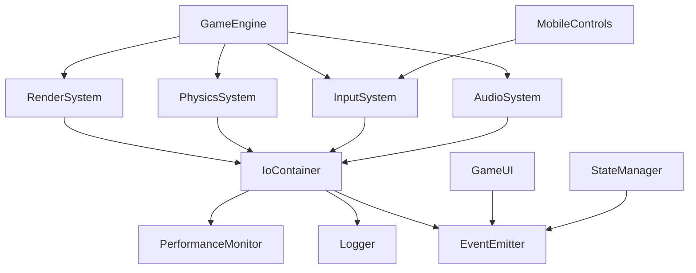

# 🔧 Technical Specifications

## RGB Light Cat - Enterprise Architecture Technical Specifications

---

## 📋 **OVERVIEW**

This document provides detailed technical specifications for the RGB Light Cat enterprise gaming platform, including system requirements, performance benchmarks, API specifications, and implementation details.

---

## 🖥️ **SYSTEM REQUIREMENTS**

### **Development Environment**
| Component | Minimum | Recommended | Enterprise |
|-----------|---------|-------------|------------|
| **Node.js** | 18.x | 20.x | 20.x LTS |
| **npm** | 8.x | 9.x | 10.x |
| **Memory** | 8GB RAM | 16GB RAM | 32GB RAM |
| **Storage** | 10GB free | 50GB free | 100GB free |
| **CPU** | 4 cores | 8 cores | 16 cores |

### **Runtime Environment**
| Platform | Minimum | Recommended | Notes |
|----------|---------|-------------|-------|
| **Desktop Chrome** | v91+ | v120+ | Primary target |
| **Desktop Firefox** | v89+ | v115+ | Full support |
| **Desktop Safari** | v14+ | v16+ | WebGL required |
| **Desktop Edge** | v91+ | v120+ | Chromium-based |
| **Mobile Chrome** | v91+ | v120+ | Touch optimized |
| **Mobile Safari** | v14+ | v16+ | iOS optimized |

### **Hardware Requirements**
| Device Type | CPU | GPU | Memory | Storage |
|-------------|-----|-----|--------|---------|
| **Desktop** | 2GHz+ dual-core | Dedicated GPU | 4GB+ RAM | 1GB free |
| **Laptop** | 2GHz+ dual-core | Integrated GPU | 4GB+ RAM | 1GB free |
| **Mobile** | 1.8GHz+ octa-core | Adreno 530+ / Mali-G71+ | 3GB+ RAM | 500MB free |
| **Tablet** | 2GHz+ quad-core | Integrated GPU | 3GB+ RAM | 500MB free |

---

## ⚡ **PERFORMANCE SPECIFICATIONS**

### **Frame Rate Targets**
| Platform | Target FPS | Minimum FPS | Maximum Frame Time |
|----------|------------|-------------|-------------------|
| **Desktop High-End** | 60 | 58 | 16.67ms |
| **Desktop Mid-Range** | 60 | 55 | 18.18ms |
| **Desktop Low-End** | 30 | 28 | 35.71ms |
| **Mobile High-End** | 60 | 55 | 18.18ms |
| **Mobile Mid-Range** | 30 | 28 | 35.71ms |
| **Mobile Low-End** | 30 | 25 | 40ms |

### **Memory Usage Targets**
| Component | Typical | Maximum | Critical Threshold |
|-----------|---------|---------|-------------------|
| **JavaScript Heap** | 50-100MB | 150MB | 200MB |
| **WebGL Textures** | 20-50MB | 80MB | 100MB |
| **Audio Buffers** | 5-15MB | 25MB | 30MB |
| **DOM Elements** | 1-5MB | 10MB | 15MB |
| **Total Memory** | 80-170MB | 250MB | 300MB |

### **Loading Performance**
| Metric | Target | Maximum | Measurement |
|--------|--------|---------|-------------|
| **First Contentful Paint** | < 1.5s | < 2.5s | Lighthouse |
| **Time to Interactive** | < 3.0s | < 5.0s | Lighthouse |
| **Game Ready** | < 3.0s | < 5.0s | Custom metric |
| **Initial Bundle** | < 300KB | < 500KB | Webpack analyzer |
| **Total Assets** | < 2MB | < 5MB | Network tab |

### **Network Performance**
| Connection Type | Target Load Time | Asset Optimization |
|----------------|------------------|-------------------|
| **Fast 3G** | < 5s | Aggressive compression |
| **4G** | < 3s | Standard compression |
| **WiFi** | < 2s | Minimal compression |
| **Fiber** | < 1s | No compression |

---

## 🏗️ **ARCHITECTURE SPECIFICATIONS**

### **System Architecture**
```
┌─────────────────────────────────────────────────────────────┐
│                    Presentation Layer                       │
├─────────────────────────────────────────────────────────────┤
│ Game UI │ Mobile Controls │ HUD │ Notifications │ Debug UI  │
├─────────────────────────────────────────────────────────────┤
│                    Application Layer                        │
├─────────────────────────────────────────────────────────────┤
│ Game Engine │ Character Controller │ World Manager         │
├─────────────────────────────────────────────────────────────┤
│                    Domain Services                          │
├─────────────────────────────────────────────────────────────┤
│ Render System │ Physics System │ Input System │ Audio      │
├─────────────────────────────────────────────────────────────┤
│                    Infrastructure Layer                     │
├─────────────────────────────────────────────────────────────┤
│ IoC Container │ Logger │ Events │ State │ Performance       │
└─────────────────────────────────────────────────────────────┘
```

### **Module Dependencies**


### **Data Flow Architecture**
```
User Input → Input System → Game Engine → Game Logic → State Manager
                                    ↓
Performance Monitor ← Audio System ← Physics System ← Render System
                                    ↓
Error Handler ← Logger ← Event Emitter ← UI System ← User Feedback
```

---

## 💾 **DATA SPECIFICATIONS**

### **Game State Structure**
```typescript
interface GameState {
  // Player state
  player: {
    position: Vector3;        // Player world position
    velocity: Vector3;        // Current velocity
    health: number;           // Health points (0-100)
    score: number;            // Current score
    level: number;            // Current level
    abilities: string[];      // Unlocked abilities
    inventory: Item[];        // Player inventory
  };
  
  // World state
  world: {
    currentLevel: string;     // Level identifier
    timeRemaining: number;    // Level time limit
    collectibles: Entity[];   // Active collectibles
    obstacles: Entity[];      // World obstacles
    environment: {
      lighting: LightConfig;
      weather: WeatherState;
      gravity: Vector3;
    };
  };
  
  // UI state
  ui: {
    activeScreen: string;     // Current UI screen
    notifications: Notification[];
    settings: UserSettings;
    controlsVisible: boolean;
  };
  
  // Performance state
  performance: {
    fps: number;              // Current FPS
    frameTime: number;        // Frame processing time
    memoryUsage: MemoryStats; // Memory consumption
    renderStats: RenderStats; // Rendering statistics
  };
}
```

### **Entity System**
```typescript
interface Entity {
  id: string;                 // Unique identifier
  type: EntityType;           // Entity classification
  position: Vector3;          // World position
  rotation: Vector3;          // Rotation angles
  scale: Vector3;             // Scale factors
  components: Component[];    // Entity components
  metadata: EntityMetadata;   // Additional data
}

interface Component {
  type: ComponentType;        // Component type
  data: any;                  // Component-specific data
  enabled: boolean;           // Component active state
}
```

### **Asset Management**
```typescript
interface AssetManager {
  // Texture specifications
  textures: {
    format: 'WebP' | 'PNG' | 'JPEG';
    compression: 'high' | 'medium' | 'low';
    maxSize: number;          // Maximum dimension
    mipmaps: boolean;         // Generate mipmaps
  };
  
  // Audio specifications
  audio: {
    format: 'OGG' | 'MP3' | 'AAC';
    quality: 'high' | 'medium' | 'low';
    maxDuration: number;      // Maximum clip length
    compression: number;      // Compression ratio
  };
  
  // Model specifications
  models: {
    format: 'GLTF' | 'GLB';
    maxVertices: number;      // Vertex limit
    maxTriangles: number;     // Triangle limit
    optimization: boolean;    // Enable optimization
  };
}
```

---

## 🔌 **API SPECIFICATIONS**

### **Core API Interfaces**
```typescript
// Container API
interface IContainer {
  register<T>(token: Token<T>, factory: Factory<T>, options?: RegistrationOptions): void;
  resolve<T>(token: Token<T>): Promise<T>;
  createScope(): IContainer;
  dispose(): Promise<void>;
}

// Logger API
interface ILogger {
  debug(message: string, data?: any): void;
  info(message: string, data?: any): void;
  warn(message: string, data?: any): void;
  error(message: string, error?: Error, data?: any): void;
  startTimer(name: string): void;
  endTimer(name: string): number;
}

// Event Emitter API
interface IEventEmitter<T extends EventMap> {
  on<K extends keyof T>(event: K, listener: EventListener<T[K]>): Subscription;
  off<K extends keyof T>(event: K, listener: EventListener<T[K]>): void;
  emit<K extends keyof T>(event: K, ...args: T[K]): boolean;
  once<K extends keyof T>(event: K, listener: EventListener<T[K]>): Subscription;
  removeAllListeners(event?: keyof T): void;
}

// Performance Monitor API
interface IPerformanceMonitor {
  getStats(): IPerformanceStats;
  startTimer(name: string): void;
  endTimer(name: string): number;
  setCustomMetric(name: string, value: number): void;
  on(event: string, callback: (data: any) => void): Subscription;
}
```

### **Game Engine API**
```typescript
interface IGameEngine {
  // Lifecycle methods
  initialize(): Promise<void>;
  start(): Promise<void>;
  stop(): Promise<void>;
  pause(): void;
  resume(): void;
  update(deltaTime: number): void;
  dispose(): Promise<void>;
  
  // State management
  getState(): GameState;
  setState(state: Partial<GameState>): void;
  getStats(): PerformanceStats;
  
  // System access
  getRenderSystem(): IRenderSystem;
  getPhysicsSystem(): IPhysicsSystem;
  getInputSystem(): IInputSystem;
  getAudioSystem(): IAudioSystem;
}
```

### **Rendering API**
```typescript
interface IRenderSystem {
  // Rendering methods
  render(scene: Scene, camera: Camera): void;
  setSize(width: number, height: number): void;
  setClearColor(color: Color): void;
  
  // Quality settings
  setQuality(quality: RenderQuality): void;
  enablePostProcessing(enabled: boolean): void;
  setShadowQuality(quality: ShadowQuality): void;
  
  // Statistics
  getDrawCallCount(): number;
  getTriangleCount(): number;
  getMemoryUsage(): GPUMemoryStats;
}
```

---

## 🛡️ **SECURITY SPECIFICATIONS**

### **Authentication & Authorization**
```typescript
interface AuthConfig {
  jwtSecret: string;           // JWT signing secret (256-bit)
  tokenExpiry: string;         // Token expiration time
  refreshTokenExpiry: string;  // Refresh token expiration
  issuer: string;             // Token issuer
  audience: string;           // Token audience
  algorithm: 'HS256' | 'RS256'; // Signing algorithm
}

interface SecurityHeaders {
  'Content-Security-Policy': string;
  'X-Frame-Options': 'DENY';
  'X-Content-Type-Options': 'nosniff';
  'Referrer-Policy': 'strict-origin-when-cross-origin';
  'Permissions-Policy': string;
}
```

### **Input Validation**
```typescript
interface ValidationSchema {
  type: 'string' | 'number' | 'boolean' | 'email' | 'url';
  required?: boolean;
  minLength?: number;
  maxLength?: number;
  min?: number;
  max?: number;
  pattern?: RegExp;
  enum?: string[];
  custom?: (value: any) => boolean;
}

interface ValidationConfig {
  enableSanitization: boolean;  // Auto-sanitize inputs
  strictMode: boolean;          // Strict validation rules
  maxStringLength: number;      // Maximum string length
  maxArrayLength: number;       // Maximum array length
  allowedTags: string[];        // Allowed HTML tags
}
```

### **Rate Limiting**
```typescript
interface RateLimitConfig {
  windowMs: number;            // Time window (milliseconds)
  maxRequests: number;         // Maximum requests per window
  skipSuccessfulRequests: boolean;
  skipFailedRequests: boolean;
  keyGenerator: (req: Request) => string;
  onLimitReached: (req: Request) => void;
}
```

---

## 📊 **MONITORING SPECIFICATIONS**

### **Performance Metrics**
```typescript
interface PerformanceMetrics {
  // Frame performance
  fps: number;                 // Frames per second
  frameTime: number;           // Frame processing time (ms)
  renderTime: number;          // Rendering time (ms)
  updateTime: number;          // Update logic time (ms)
  
  // Memory usage
  memoryUsage: {
    used: number;              // Used memory (bytes)
    total: number;             // Total memory (bytes)
    percentage: number;        // Usage percentage
  };
  
  // Network performance
  networkLatency: number;      // Average latency (ms)
  bandwidth: number;           // Available bandwidth (kbps)
  requestsPerSecond: number;   // API requests per second
  
  // Error rates
  errorRate: number;           // Errors per minute
  crashRate: number;           // Crashes per session
  recoveryRate: number;        // Recovery success rate
}
```

### **Alert Thresholds**
```typescript
interface AlertThresholds {
  fps: {
    warning: 30;               // FPS warning threshold
    critical: 15;              // FPS critical threshold
  };
  memory: {
    warning: 80;               // Memory warning (%)
    critical: 95;              // Memory critical (%)
  };
  latency: {
    warning: 200;              // Latency warning (ms)
    critical: 500;             // Latency critical (ms)
  };
  errors: {
    warning: 10;               // Errors per minute warning
    critical: 50;              // Errors per minute critical
  };
}
```

### **Logging Specifications**
```typescript
interface LogEntry {
  timestamp: string;           // ISO 8601 timestamp
  level: LogLevel;             // Log severity level
  logger: string;              // Logger name
  message: string;             // Log message
  data?: any;                  // Additional data
  error?: {
    name: string;              // Error name
    message: string;           // Error message
    stack: string;             // Stack trace
  };
  context?: {
    userId?: string;           // User identifier
    sessionId: string;         // Session identifier
    requestId?: string;        // Request identifier
    userAgent: string;         // Browser user agent
    url: string;               // Current URL
  };
}
```

---

## 🧪 **TESTING SPECIFICATIONS**

### **Test Coverage Requirements**
| Component Type | Minimum Coverage | Target Coverage |
|----------------|------------------|-----------------|
| **Core Systems** | 95% | 98% |
| **Game Logic** | 90% | 95% |
| **UI Components** | 85% | 90% |
| **Utilities** | 90% | 95% |
| **Integration** | 80% | 85% |
| **E2E Scenarios** | 70% | 80% |

### **Performance Test Specifications**
```typescript
interface PerformanceTestConfig {
  // Load testing
  concurrentUsers: number;     // Simultaneous users
  testDuration: number;        // Test duration (seconds)
  rampUpTime: number;          // Ramp up time (seconds)
  
  // Stress testing
  maxUsers: number;            // Maximum user load
  breakingPoint: number;       // Expected breaking point
  recoveryTime: number;        // Recovery time after stress
  
  // Endurance testing
  sustainedLoad: number;       // Sustained user load
  enduranceDuration: number;   // Test duration (hours)
  memoryLeakThreshold: number; // Memory leak detection
}
```

### **Browser Test Matrix**
| Browser | Versions | Platforms | Priority |
|---------|----------|-----------|----------|
| **Chrome** | Latest 3 | Windows, macOS, Linux, Android | Critical |
| **Firefox** | Latest 3 | Windows, macOS, Linux | High |
| **Safari** | Latest 2 | macOS, iOS | High |
| **Edge** | Latest 2 | Windows | Medium |
| **Opera** | Latest 1 | Windows, macOS | Low |

---

## 🚀 **DEPLOYMENT SPECIFICATIONS**

### **Environment Configuration**
```typescript
interface EnvironmentConfig {
  // Environment settings
  NODE_ENV: 'development' | 'staging' | 'production';
  API_BASE_URL: string;
  CDN_BASE_URL: string;
  
  // Feature flags
  ENABLE_DEBUG_MODE: boolean;
  ENABLE_PERFORMANCE_MONITORING: boolean;
  ENABLE_ERROR_REPORTING: boolean;
  ENABLE_ANALYTICS: boolean;
  
  // Performance settings
  TARGET_FPS: number;
  ENABLE_VSYNC: boolean;
  QUALITY_LEVEL: 'low' | 'medium' | 'high';
  
  // Security settings
  JWT_SECRET: string;
  API_RATE_LIMIT: number;
  CORS_ORIGINS: string[];
}
```

### **Build Configuration**
```typescript
interface BuildConfig {
  // Bundle settings
  target: 'es2020';
  format: 'esm';
  minify: boolean;
  sourcemap: boolean;
  
  // Code splitting
  chunkSizeWarningLimit: 500; // KB
  manualChunks: {
    'vendor-three': ['three'];
    'vendor-ui': ['react', 'react-dom'];
    'game-core': ['src/core'];
    'game-modules': ['src/modules'];
  };
  
  // Optimization
  treeshaking: boolean;
  deadCodeElimination: boolean;
  cssMinification: boolean;
  imageOptimization: boolean;
}
```

### **Docker Specifications**
```dockerfile
# Multi-stage build configuration
FROM node:20-alpine as builder
WORKDIR /app
RUN apk add --no-cache git python3 make g++

FROM nginx:alpine as production
COPY --from=builder /app/dist /usr/share/nginx/html
COPY nginx.conf /etc/nginx/nginx.conf

# Security hardening
RUN addgroup -g 1001 -S nodejs && \
    adduser -S appuser -u 1001
USER appuser

# Health check
HEALTHCHECK --interval=30s --timeout=3s --start-period=5s --retries=3 \
  CMD wget --no-verbose --tries=1 --spider http://localhost/health || exit 1

EXPOSE 80
CMD ["nginx", "-g", "daemon off;"]
```

---

## 📈 **SCALABILITY SPECIFICATIONS**

### **Horizontal Scaling**
| Load Level | Instances | CPU | Memory | Network |
|------------|-----------|-----|--------|---------|
| **Light** | 1-2 | 1 vCPU | 1GB | 100Mbps |
| **Medium** | 3-5 | 2 vCPU | 2GB | 500Mbps |
| **Heavy** | 6-10 | 4 vCPU | 4GB | 1Gbps |
| **Peak** | 11-20 | 8 vCPU | 8GB | 10Gbps |

### **Database Scaling**
```typescript
interface DatabaseConfig {
  // Connection pooling
  connectionPool: {
    min: number;               // Minimum connections
    max: number;               // Maximum connections
    idleTimeout: number;       // Idle timeout (ms)
    acquireTimeout: number;    // Acquire timeout (ms)
  };
  
  // Caching
  cache: {
    enabled: boolean;          // Enable caching
    ttl: number;               // Time to live (seconds)
    maxSize: number;           // Maximum cache size (MB)
    strategy: 'LRU' | 'LFU';   // Eviction strategy
  };
  
  // Replication
  replication: {
    enabled: boolean;          // Enable read replicas
    readReplicas: number;      // Number of read replicas
    writeTimeout: number;      // Write operation timeout
    readTimeout: number;       // Read operation timeout
  };
}
```

### **CDN Configuration**
```typescript
interface CDNConfig {
  // Global distribution
  regions: [
    'us-east-1',    // North America East
    'us-west-1',    // North America West
    'eu-west-1',    // Europe
    'ap-southeast-1' // Asia Pacific
  ];
  
  // Caching strategy
  caching: {
    static: '1y';              // Static assets cache
    dynamic: '1h';             // Dynamic content cache
    api: '5m';                 // API response cache
  };
  
  // Compression
  compression: {
    gzip: true;                // Enable gzip
    brotli: true;              // Enable brotli
    level: 6;                  // Compression level
  };
}
```

---

## 🔧 **CONFIGURATION SPECIFICATIONS**

### **Development Configuration**
```json
{
  "environment": "development",
  "debug": true,
  "hotReload": true,
  "sourceMap": true,
  "performance": {
    "targetFPS": 60,
    "enableProfiling": true,
    "showStats": true
  },
  "security": {
    "corsEnabled": true,
    "allowedOrigins": ["http://localhost:3000"],
    "rateLimiting": false
  }
}
```

### **Production Configuration**
```json
{
  "environment": "production",
  "debug": false,
  "hotReload": false,
  "sourceMap": false,
  "performance": {
    "targetFPS": 60,
    "enableProfiling": false,
    "showStats": false
  },
  "security": {
    "corsEnabled": true,
    "allowedOrigins": ["https://rgblightcat.com"],
    "rateLimiting": true,
    "rateLimitRequests": 100,
    "rateLimitWindow": 60000
  }
}
```

---

**This technical specification serves as the authoritative reference for RGB Light Cat's enterprise architecture implementation.**

---

*Technical Specifications for RGB Light Cat v2.0 Enterprise Edition*  
*Last Updated: August 4, 2025*